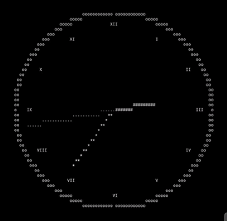
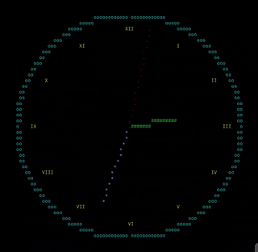

# tuiclock

Terminal-based ASCII clock with animated hands.





## Features

- Real-time analog clock display
- Roman numerals for hours (when terminal width >= 60 columns)
- Hour, minute, and second hands
- Optional color support
- Terminal-aware scaling

## Usage

```bash
# Basic usage
cargo run

# With color
cargo run -- --color

# Exit
Press 'q'
```

## Requirements

- Rust 1.70+
- Terminal with at least 30x15 characters

## Dependencies

- chrono: Time handling
- crossterm: Terminal control
- ratatui: TUI framework

## Installation

```bash
git clone <repository>
cd tuiclock
cargo build --release
./target/release/tuiclock
```
